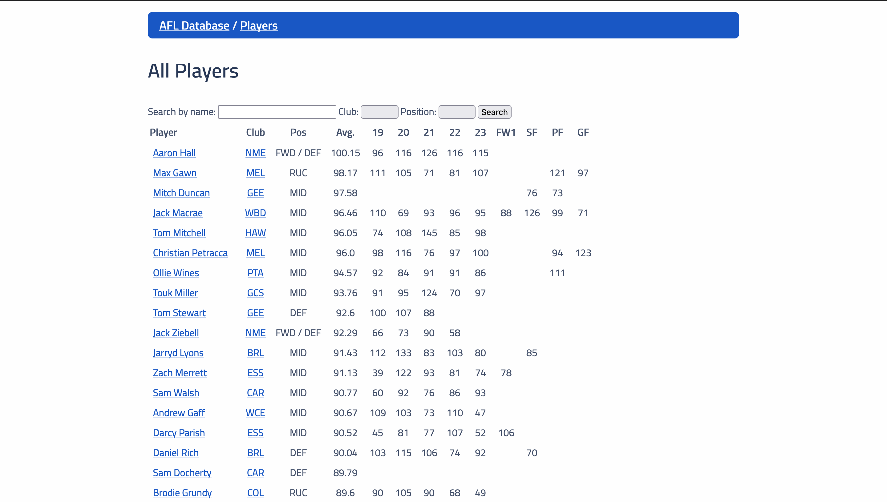

# AFL Database

by Daniel Nguyen, October 2021

Check out the live version [here](https://afl-db.herokuapp.com)!

BUT [here](https://github.com/the-daniel-nguyen/project1) is a better version I started working on after the presentation.

## 📖 Background

This was my second project in General Assembly's Software Engineering Immersive, completed during Week 6 of the 12-week course. It took me five days to write.

It demonstrates everything we'd learnt so far about Ruby on Rails.

## 🎯 Project Brief

The brief was simply to create any kind of web application that demonstrated our understanding of CRUD databases.

See the full spec here: [Project-Brief.md](Project-Brief.md).

## 🛠 Web Scraping

Gems used:

* `httparty`
* `nokogiri`

To get actual data from:

* https://fixturedownload.com/results/afl-2021
* https://afltables.com/afl/stats/2021.html
* http://dtlive.com.au/afl/dataview.php

## 🪲 Bugs

...

## 🙏 Coming soon

...
